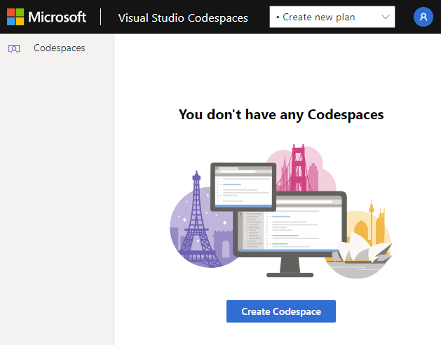
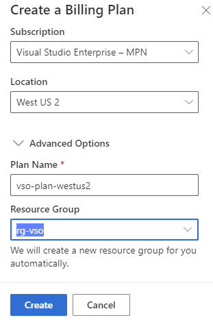
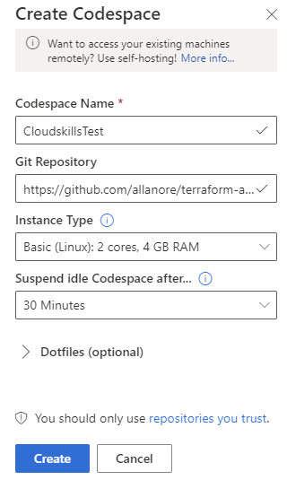
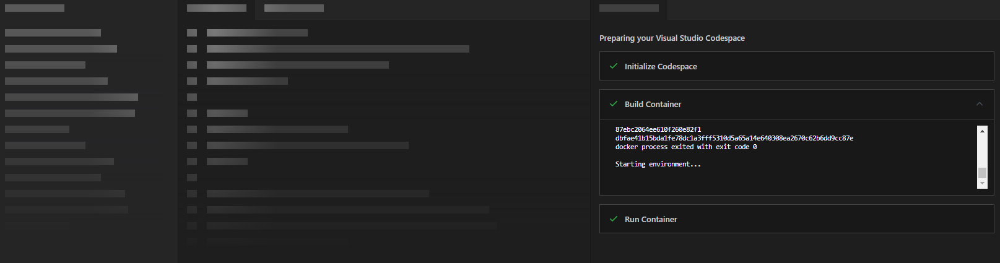
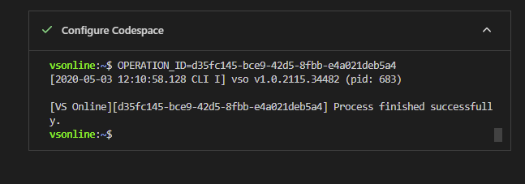

## Module 1: Terraform on Azure: The Big Picture


### How to set up VSCodeSpaces

Visual Studio Codespaces is an online version of Visual Studio Code. It allows us to automatically deploy an environment with a code repository so we can dive into Terraform with minimal setup.  

> **Note:** The compute for this service will be hosted in your Azure tenant, so there will be some charges associated. The average cost for a basic environment is around $0.08 per hour. Also, environments can be in a "suspended" and "active" state, which reduces pricing even further. For more information on VSC billing, check out the [pricing page](https://azure.microsoft.com/en-us/pricing/details/visual-studio-online/). 

 
To create the Codespaces environment, navigate to the [Visual Studio Codespaces](https://online.visualstudio.com/login) login page and sign in with your Azure credentials. Make sure to use Google Chrome as FireFox and Edge are not yet supported. Once logged in, we will be presented with the following page below. Select **Create Codespace**:



Next, we need to create a billing plan. The billing plan connects the Visual Studio Codespace environment to our Azure subscription. Select a location that makes sense for you. Also, you can input a plan name according to your Azure naming standards. The plan name is the name of the Azure resource that deploys to your subscription. Next, we need to specify the resource group to host the Visual Studio Codespace resource. When done configuring these settings select **Create**:



Now we can set up our Codespace; this is the Visual Studio environment. We could have multiple Codespaces in our plan if we wanted to. Input a **Codespace Name** for the Codespace. Under **Git Repository** paste in the following GitHub repo:
```
https://github.com/CloudSkills/Terraform-Projects
```
Under **Instance Type**, select the Basic type. Next, select **Create** to build out our VSC environment:



We should see our environment starting to build and the post-create.sh script automatically executes and installs our tools and extensions:
>**Note:** You may need to refresh your browser at some point to get this screen to show up.



Once the **Configure Codespace** section shows complete, we are ready to move on to  reviewing the folder structure of this repository:

